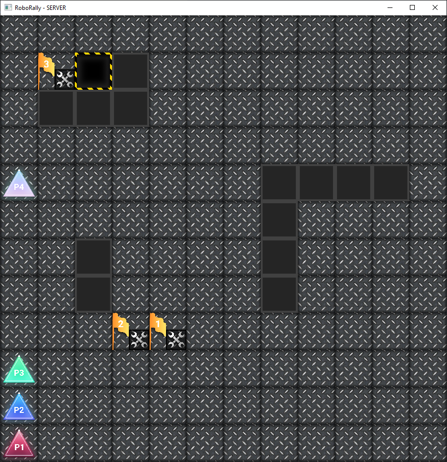

# Oblig 3 Gruppe 5H

## Deloppgave 1

### Retrospektiv: 

#### Roller i teamet:
Vi har ikke lenger libgdx ansvarlig da Håkon har tatt over som kundekontakt etter at Henrik har forlatt gruppen.
Skjalg er nå bare "Kodeansvarlig" og har overordnet ansvar for kode, at ting følger konvensjoner etc.
Spesifikasjonsansvarlig er også ansvarlig for design-dokumenter og klassediagram.

#### Kommunikasjon og gruppedynamikk:
- Fra forrige gang har vi hatt en litt mer jevn deltagelse i noen diskusjoner, mens i andre er det fortsatt de samme som dominerer.
- Har innført møter i forelesningstimene når det ikke er forelesning.

#### Projekt Metodikk:
- Vi føler at vi iløpet av oblig 2 fikk til Kanban prinsippene enda bedre enn før.
Vi fortsetter med dette og å bruke kanban og prøve å ytterligere forbedre kanban bruken vår. Vi fortsetter også med standup
  da vi føler det er en veldig hjelpsom metodikk for å ha gode gruppemøter.
  
#### Oppsumering av forbedringspunkter for denne oblig:
- Forbedre kanban bruk ytterligere
- La alle få prøve seg på game.java

#### Metoder vi ønsker å ta i bruk:
- Vi ønsker å bruke skisser/low-fidelity prototypes for design av GUI

---
## Deloppgave 2
### Brukerhistorier

**GUI - Kort**

*Brukerhistorie:* Som bruker ønsker jeg å kunne se oppdatert info om hvilke kort jeg får tildelt, og hvilke kort jeg har valgt, slik at jeg kan planlegge turen min.

*Akseptansekrav:* Tilgjengelige og valgte kort vises i GUI.

*Arbeidsoppgaver:*
- Endre måten posisjon av Sprite kalkuleres i Game.java, se Issue#12 for detaljer.
- Lage en funksjon som tar en hånd med kort og viser de tilgjengelige kortene i GUI, og de valgte kortene separat i GUI.
- Sørge for at funksjonen for å rendere kortene blir kalt hver gang spilleren:
    - Velger et kort
    - Fjerner et valgt kort
    - Mottar nye kort.
- Kan kalle funksjonen i Game.render() for at dette skal bli oppdatert ved alle disse tilfellene, eller i de nødvendige funksjonene.

**GUI - HUD**

*Brukerhistorie:* Som bruker ønsker jeg å kunne ha oversikt over antall liv jeg har igjen i spillet, og mengden skade jeg har tatt, slik at jeg kan holde oversikt over hvordan jeg ligger an i spillet.

*Akseptansekrav:* Liv og skade vises i GUI

*Arbeidsoppgaver:*

- Endre måten posisjon av Sprite kalkuleres i Game.java, se Issue#12 for detaljer.
- Lage en funksjon i Game.java for å vise liv og skade i GUI (Kan være void og trenger ikke ta inn variabler)
- Sørge for at funksjonen viser Player.getHp() som total mengde liv
- Sørge for at funksjonen viser mengde skade, gjerne via Player.getPc() men må da ta forbehold om at denne teller nedover fra 9 til 0. Kan evt. endre hvordan PC counter i Player fungerer da denne ikke blir brukt enda.

**Laser**

*Brukeristorie*:
Som en spiller ønsker jeg at roboten min skyter laser etter en runde slik at andre spillere sine roboter tar skade.

*ArbeidsOppgaver:*
Lage en metode i game som itererer over hver spiller og skyter laser ifra roboten. Laseren skal skytes i retningen roboten peker til den treffer en vegg, går utenfor brettet eller treffer en annen spiller. Laser gjør 1 skade på spillere.

*Akseptansekrav:*
Det er laget en metode som kan kalles etter hver runde, som vil skyte laseren til hver av spillerenes roboter og gjøre skade på roboter som treffes av laseren.

**Kollisjon**

*Brukerhistorie:*
Som en spiller ønsker jeg at hvis en annen spiller står i veien for roboten min kan jeg skyve hans robot foran min (gitt at veien er klar), slik at jeg kan manipulere andre spilleres posisjon for min egen vinning.

*ArbeidsOppgaver*:
Lage en metode som sjekker om en annen robot står i veien for en robot som skal flyttes. Hvis det er tilfelle så skal den roboten returneres samt informasjon om den kan dyttes.
*Akseptansekrav*:
En metode som sjekker for kollisjon mellom en robot som flyttes og andre roboter. Må kunne plugges inn i Move-logikken på et senere tidspunkt

### Forklar kort hvordan dere har prioritert oppgavene fremover:
Vår prioritet denne innleveringen har vært å legge til GUI del til spillevinduet. 
Utover dette har vi lagt til mindre funksjoner til spillet og fikset feil/bugs.
Vi fokuserer på at noen alltid jobber med oppgaver i Hovedfokus. Hvis det ikke er flere oppgaver i hovedfokus 
som kan tildeles, kan de som ikke har tildelte oppgaver jobbe med andre oppgaver.

**Oppgaver i Hovedfokus:**
- GUI
    - Spillebrettet må ikke ta hele vinduet
    - Vise kort man har fått tildelt
    - Vise kort man har valgt
    - Vise liv, skade og spiller-nummer
- Fikse kritiske bugs
    - Desynkronisering mellom spillebrett (både lokalt og over internett)
    - Travis build errors
    

**Andre Oppgaver:**
- Legge til metode som kan skyter laser
- Fikse flagg til å ha bestemt rekkefølge de skal plukkes opp
- Legge til metode som håndterer kollisjon
- Tester for de funksjoner som legges til
- GUI  
    - Kunne klikke på kort for å velge dem istedenfor bruke tastatur
    - Knapp for å sende kort
 - Legge til en phase "EndOfRegister" som håndterer alt som skjer mellom hvert register, f.eks. laser, og andre brettfunksjoner. 

#### Bugs
Se readme / project board for bugs.

---
## Deloppgave 3

#### Teknisk produktoppsett
Software som trengs:
- Last ned java versjon 13 eller nyere (https://www.oracle.com/java/technologies/javasedownloads.html)
- En IDE, eksempelvis IntelliJ (https://www.jetbrains.com/idea/download/#section=windows)
  Setup:
- Klon prosjektet fra github / last ned .zip med nyeste tagged commit

For å kjøre koden:
1. Åpne prosjektet i IntelliJ (eller annen IDE), kjør Main.java.
2. Velg "server", antall spillere du ønsker i spillet, og porter. (hvis du velger 1 spiller så      avslutter spillet etter en runde, da du vinner)
    - Angående valg av porter så kan du bruke port 1 hvis du spiller lokalt. Hvis du spiller via internett må du velge egne porter og hosten må portforwarde. Hvilke porter som er tilgjengelig for dette er avhengig av Internettleverandør, nettverksinstillinger og installert programvare. For vår testing har vi brukt port 3074.
3. Avhenger om du vil spille alene eller med andre
    - Dersom du ønsker å spille med andre må porten du velger være port-forwardet i ruter instillingene dine,
da følger de andre samme steg som deg, men velger "client" i punkt 2. Du som server må finne ip-adressen din, eksempelvis på
https://whatismyipaddress.com/. Client må skrive inn denne ip adressen (IPv4), så portene du valgte i steg 2.
    - 3.2 Dersom du ønsker å spille aleine (for testing), kjør Main2, velg "client", velg "localhost" som ip, og samme porter du valgte i steg 2.
4. Når antall spillere som er med i spillet er lik antall spillere du valgte når du satt opp "server" starter spillet,
og alle får tildelt en hånd. Denne blir for nå printet i konsollen. Du har bevegelse [prioritet]. Du velger disse ved å bruke
tastene 1-9. Når 5 kort er valgt blir disse sendt til serveren, og du avventer resten av spillerene. Når alle har sendt bevegelser
skjer bevegelsene steg for steg for alle spillere. (KNOWN BUG: Desync, noen ganger skjer feile ting for Client, jobber med å fikse dette)

For å bygge koden:
- Kjør `mvn clean install`. (Testet til å funke på alle platformer, skal få build success)

#### Bygging:
- Vi har alle windows som OS og bruker Travis for å sjekke om det bygger på Linux/Mac. Ifølge Travis bygger prosjektet vårt.

#### Klassediagram:
Vi har generert klassedigram med Object Aid Explorer. Dette er en Eclipse Plugin som finnes her: https://marketplace.eclipse.org/content/objectaid-uml-explorer.
ObjectAid generer ønsket klassediagram for valgte klasser, viser frem innhavende metodene og feltvariabler. Det kan også vise fram dependencies som vi også har gjort, dette vises frem med piler.

De generert diagrammene benytter seg av samme symbolikk som UML digram gjør.
- Grønne sirkler står for public
- Røde firkanter er private
  Selve boksene benytter seg også av vanlig UML syntax. 3 ledd. Navnet på klassen, et felt for variabler, tilsutt et felt for metodene.

Klassediagramene er laget for de ulike pakkene: skeleton.app, skeleton.app.cards, skeleton.app.net, skeleton.app.sprites

#### Tester
**Automatiske tester:**

De automatiske testene våre dekker store deler av kodebasen. For mer detaljert forklaring av hva de automatiske testene dekker, se ObligatoriskOppgave2.md . 

Fra forrige gang har vi utvidet Flagtestene til å håndtere ny oppførsel og lagt til flere tester for Laser og Kollisjon.
Flaggtestene tester nå at man må plukke opp flagg i korrekt rekkefølge dvs. flagg 1 først, så flagg 2 og flagg 3 til sist.

Laser og Kollisjonstestene skiller seg litt ut fra de andre klassene da de benytter game klassen, dette skaper en del errors, men de kjører tross dette. 
Vi ønsker å fikse dette ved en senere annledning hvis det lar seg gjøre.

Disse to testene skiller seg også fra de andre da de er mer avhengige av brettene. Testene inneholder mindre kode i selve testene, 
og er gjerne ganske like bortsett fra hvilket brett de benytter. Når det skal testes om en spiller kolliderer eller blir beskutt av laser,
gjør vi dette ved å lage ett brett med disse situasjonene. Det er derfor laget flere testbrett som brukes utelukkende i testene for å teste oppsatte
scenarioer. Testbrett har nummer >= 100. Det finnes også bilder av alle brett i deliverables/Brett folderen.

F.eks. for testen Player1CanPushPlayer2WhoPushesPlayer3() er det satt opp et brett, Brett111 vist under, hvor disse tre spillerne står på rekke, 
slik at player1 pusher de to andre når den prøver å bevege seg fremover (retning nord).

**Manuelle tester:**

Det er laget noen manuelle tester for oppførsel vi ikke kan teste automatisk. Dette inngår f.eks.
å se at det å velge et kort og så sende det etter å ha valgt 5 kort vil føre til at roboten oppfører seg slik
kortvalgene tilsier.

*@BeforeEach*
- Setup:
    - Start the game (se teknisk produkt oppsett for instrukser)

*MoveForwardTest:*
- Select the move card. The player Sprite should then move forward.

*RotateClockwiseTest*:
- Select a clockwise rotation card. The player Sprite should then rotate 90 degrees clockwise.

*RotateCounterClockwiseTest*:
- Select a clockwise rotation card. The player Sprite should then rotate 90 degrees counterclockwise.

*OutOfBoundsTest*
- Select cards so that the player goes out of bounds. The HP should then go down 1. (Check output in console)

*HoleTest*
- Select cards so that the player goes in a hole. The HP should then go down 1. (Check output in console)

*FlagTest*
- Select cards so that the player goes on all the 3 flags. The player should then win (Order does not matter yet)

#### Produktets funksjonalitet:
I forrige obligatoriske oppgave fullførte vi MVP.
I denne innleveringen har vi lagt til følgende funksjonalitet:
- GUI
    - Vise kort i hånd
    - Vise valgte kort
    - Vise liv, skade og spillebrikke i GUI
    - Litt annet i GUI for senere implementasjoner (knapper o.l.)
    
- Flagg oppførsel følger reglene
- Laser
    - Ikke implementert i selve spilllogikken da vi ikke har laget logikken for fasen hvor laserer avfyres
- Kollisjon
  - Ikke implementert i flyttelogikken, da vi avventer dette.

#### Kommentarer til kode og utførelse

Commits er som forrige gang ujevne. Dette har seg med at det er mange commits fra mindre prosjekter (laser, kollisjon og tester for disse) samt bugfixes, mens de andre gruppemedlemmene jobbet med å 
få til GUI. Dette viste seg å være en svært vanskelig jobb, og mesteparten av arbeidet fra disse gruppemedlemmene ble da å få forståelse. Vi prøvde så å implementere GUI i felleskap og fikk det ikke helt til
men til slutt klarte Skjalg å få til en kjørende versjon basert på forarbeidet til resten. Dette fører til ujevne commits da arbeidet til de som originalt jobbet med GUI ikke er reflektert i commitsene.
